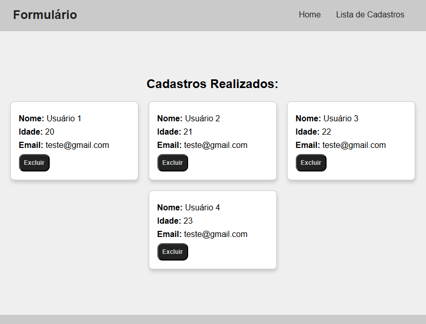

# Começando com o Create React App

Este projeto foi iniciado com o [Create React App](https://github.com/facebook/create-react-app).

## Sobre o projeto:

O projeto consiste em salvar cadastros de usuários adicionados a partir de um formulário, listar todos os usuários cadastrados, e os novos cadastros, assim como excluir usuários já cadastrados.

Com salvamento local (LocalStorage), os novos cadastros e usuários antes cadastrados, serão salvos em sua máquina, e listados sempre que acessar novamente o website.

### página de cadastro:


Com uma interface simples, o intuído foi focar na manipulação do cadastro, para salvamento local, e recuperação dos dados.

### lista de cadastros:


## Funcionalidades
- Cadastro de usuários
- Salvamento em LocalStorage
- Lista de usuários já cadastrados
- Exclusão de usuários


## Tecnologias Usadas
- HTML
- CSS
- JavaScript
- React
- React Router

## Instalação
1. Clone o repositório:
   ```bash
   git clone https://github.com/Mikaelk9/Formulario.git 
   ```
2. No diretório do projeto, você pode rodar:
   ```bash
   ### `npm start`
   Roda o app no modo de desenvolvimento.\
   Abra [http://localhost:3000](http://localhost:3000) para visualizá-lo no seu navegador.
   ```
3. Execute as funcionalidades:
   ```bash
   - Cadastros de usuários
   - Salvamento local 
   - Exclusão de usuários
   ```


## Scripts Disponíveis

### `npm test`

Inicia o runner de testes no modo de observação interativo.\
Veja a seção sobre [executando testes](https://facebook.github.io/create-react-app/docs/running-tests) para mais informações.

### `npm run build`

Cria a versão para produção do app na pasta `build`.\
Ele agrupa corretamente o React no modo de produção e otimiza o build para a melhor performance.

O build é minificado e os nomes dos arquivos incluem os hashes.\
Seu app está pronto para ser implantado!

Veja a seção sobre [implantação](https://facebook.github.io/create-react-app/docs/deployment) para mais informações.

### `npm run eject`

**Nota: essa é uma operação irreversível. Após usar `eject`, não será possível voltar!**

Se você não estiver satisfeito com as escolhas de ferramentas e configurações de build, pode usar o comando `eject` a qualquer momento. Esse comando removerá a dependência única de build do seu projeto.

Em vez disso, ele copiará todos os arquivos de configuração e as dependências transitivas (webpack, Babel, ESLint, etc.) diretamente para o seu projeto, permitindo que você tenha total controle sobre elas. Todos os comandos, exceto `eject`, ainda funcionarão, mas eles apontarão para os scripts copiados, permitindo que você os ajuste conforme necessário. A partir desse ponto, você estará por conta própria.

Você não precisa usar o comando `eject` nunca. O conjunto de recursos oferecido é adequado para implantações pequenas e médias, e você não deve se sentir obrigado a usar esse recurso. No entanto, entendemos que essa ferramenta não seria útil se você não pudesse personalizá-la quando estivesse pronto para isso.

## Saiba Mais

Você pode aprender mais na [documentação do Create React App](https://facebook.github.io/create-react-app/docs/getting-started).

Para aprender React, confira a [documentação do React](https://reactjs.org/).

### Divisão de Código

Esta seção foi movida para cá: [https://facebook.github.io/create-react-app/docs/code-splitting](https://facebook.github.io/create-react-app/docs/code-splitting)

### Analisando o Tamanho do Pacote

Esta seção foi movida para cá: [https://facebook.github.io/create-react-app/docs/analyzing-the-bundle-size](https://facebook.github.io/create-react-app/docs/analyzing-the-bundle-size)

### Criando um Progressive Web App

Esta seção foi movida para cá: [https://facebook.github.io/create-react-app/docs/making-a-progressive-web-app](https://facebook.github.io/create-react-app/docs/making-a-progressive-web-app)

### Configuração Avançada

Esta seção foi movida para cá: [https://facebook.github.io/create-react-app/docs/advanced-configuration](https://facebook.github.io/create-react-app/docs/advanced-configuration)

### Implantação

Esta seção foi movida para cá: [https://facebook.github.io/create-react-app/docs/deployment](https://facebook.github.io/create-react-app/docs/deployment)

### `npm run build` falha ao minificar

Esta seção foi movida para cá: [https://facebook.github.io/create-react-app/docs/troubleshooting#npm-run-build-fails-to-minify](https://facebook.github.io/create-react-app/docs/troubleshooting#npm-run-build-fails-to-minify)
